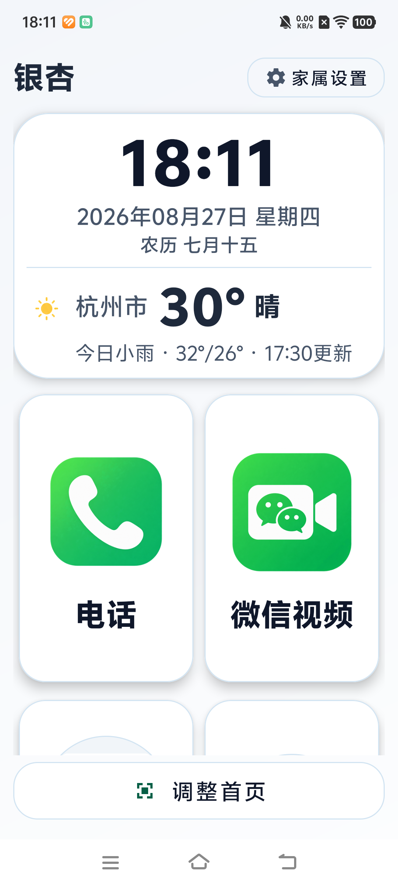
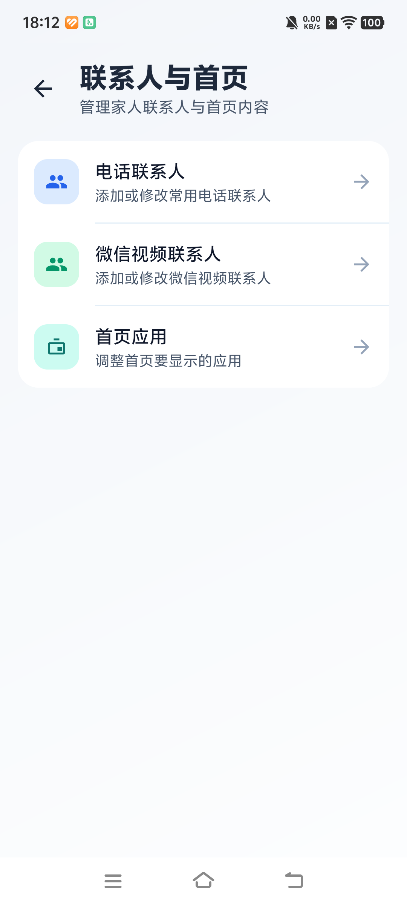
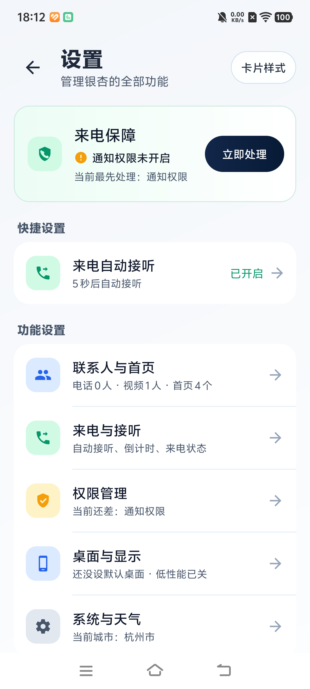

<div align="center">


<h1>银杏 · Yinxing Launcher</h1>

<p><strong>给长辈一个真正能用的 Android 首页</strong></p>

[](LICENSE)
[](https://yinxing.722688.xyz)
[](#下载安装)
[](https://github.com/bjfwan/yinxing/releases)
[](https://github.com/bjfwan/yinxing/stargazers)

**大字、大图标只是起点。银杏真正想解决的是：长辈能不能稳定地找到家人、拨出电话，并在不同手机和软件版本上继续用下去。**

</div>

---

## 为什么做银杏

很简单：**我爷爷不会使用过于复杂的智能手机功能。**

现在的手机字体小、入口多，年轻人觉得顺手的操作，老人可能要翻好几层。市面上有不少老人桌面，但我还是想自己做一个给爷爷用的：简单、干净、够用，遇到问题也能知道问题出在哪里。

> **天行健，君子以自强不息。**

我相信，技术进步要向上突破，也要让普通人用得上。我是普通的计算机学生，我愿把所学变成责任，帮助更多人不被 AI 时代落下。借助新一代 AI，我更新了银杏，初衷不变：**让老人更简单地使用手机，让科技更有温度。**

---

## 银杏重点做了什么

银杏不是只把桌面图标放大。它把老人每天最常用的桌面、电话和微信视频做成主流程，并把最容易失败的微信自动操作单独做成了一套可观察、可切换、可诊断的执行系统。

### 1. 微信视频不是一条写死的点击路线

普通坐标脚本只要按钮位置、启动页面或微信版本稍有变化，整条流程就会中断。银杏目前使用的是 **语义页面识别 + 能力接口 + 轻量行为树**：

```text
观察当前页面 → 选择下一项能力 → 执行一次 → 验证结果 → 必要时局部换路
```

系统会识别微信首页、搜索页、联系人详情、聊天页和音视频菜单，而不是只记住“第几个位置”。当前能力包括：

- 启动微信并判断当前页面；
- 验证当前聊天是否为目标联系人；
- 从最近消息进入目标聊天；
- 搜索并打开目标联系人；
- 打开音视频入口并选择视频通话；
- 确认真正进入视频呼叫页面；
- 页面置信度不足时等待、回到微信首页或安全停止。

当前有三条可组合入口路线：

| 路线 | 适用情况 |
|------|----------|
| 当前聊天 | 微信启动后已经位于目标聊天或详情页 |
| 最近消息 | 微信首页能够找到目标会话 |
| 搜索 | 最近消息不可用时，通过联系人搜索进入 |

每个能力只负责一件事，每一步之后重新观察页面。某条路线失败时可以从当前状态切换备用路线，不必盲目重放整条操作。

> 当前交付的是从银杏主动发起微信视频，不包含微信来电自动接听。

### 2. 示教不是录制坐标再回放

不同厂商、Android 版本和微信版本可能使用不同控件。银杏提供微信视频示教，让家属在本机人工完成一次流程，用来校准搜索、联系人、更多、音视频入口和视频确认等固定语义控件。

- 只保存资源 ID、控件类型、固定语义标签、相对位置和页面状态；
- 不保存联系人姓名、搜索内容、聊天文字、头像、截图、录音或视频；
- 未真正进入视频呼叫状态的示教不能成为可执行规则；
- 示教资料只用于对应设备和微信版本的受控兜底；
- 旧版任意步骤路径回放已经退出执行链路。

这不是让手机“记住用户点过哪里”，而是帮助现有语义能力适配当前设备上的控件差异。

### 3. 失败不再只显示一句“拨打失败”

微信自动化失败时，银杏会生成脱敏的结构化样本，记录：

- 执行到哪项能力；
- 识别到什么语义页面；
- 使用哪条路线；
- 页面置信度和窗口类型；
- 失败原因、状态指纹和能力时间线；
- 设备、Android 与微信版本信息。

用户同意上传后，样本会进入项目开发者使用的私有 LogAnalyse 维护后台。该后台不是银杏的公开功能，也不向普通用户或公众开放。开发者可以在后台将相同指纹的失败自动聚类，按能力、页面、路线、失败原因和处理状态筛选，查看一次完整能力链，并把样本标记为待处理、已复现、已修复或已忽略。

因此，陌生机型上的失败可以沉淀为明确的适配任务，而不是继续堆新的固定坐标。

### 4. 通话结束后，安全回到老人桌面

家属可以开启“通话结束返回首页”。它不是持续抢占前台，而是一次性的通话会话：

- 只处理从银杏发起的系统电话和微信视频；
- 必须先确认电话接通或进入微信视频页面；
- 挂断或取消后只返回一次银杏首页；
- 普通手动通话、来电和跌倒求助不会触发；
- 通话期间用户主动切到其他应用时，不会强行抢回桌面；
- 可在家属设置中完全关闭。

这让长辈打完电话后回到熟悉的首页，同时不影响手机的正常使用。

---

## 完整能力

### 老人每天直接使用

| 能力 | 已实现的细节 |
|------|--------------|
| 极简首页 | 时间、日期、农历、天气、电话、微信视频和家属选定应用集中展示 |
| 电话联系人 | 本地增删改查、系统通讯录导入、头像、列表/宫格布局、一键拨号 |
| 微信视频联系人 | 本地管理、搜索、置顶、头像、通话次数排序和一键主动拨打 |
| 应用内天气 | 天气详情、城市管理、当前位置、磁盘缓存；定位失败时保留原城市，不把老人丢到第三方页面 |
| 系统电话接听 | 默认电话角色、`InCallService`、联系人自动接听、可调倒计时和接听结果诊断 |
| 通话后回首页 | 系统电话与微信视频共用一次性返回会话，并识别用户主动离开 |
| 安全守护 | 可选跌倒检测、误报取消和呼叫家人；公开数据回放结果与真机效果分开说明 |

### 家属负责配置

- 第一次使用由家属完成默认桌面、联系人和必要权限配置；
- 电话联系人、微信视频联系人和首页应用集中管理；
- 自动接听、倒计时、通话后回首页和紧急联系人均可单独设置；
- 字体支持跟随系统、标准、较大和特大；
- 首页图标大小、整卡点击、布局锁定和长按时间可调整；
- 支持浅色、深色和跟随系统；
- 低性能模式可减少非必要动画，照顾性能较弱的旧手机；
- 权限页会分别检查电话、通知、无障碍、电池、自启动和后台弹出能力；
- 默认桌面优先使用 Android 正式 Home 能力，厂商限制下提供明确引导和可选回退。

### 本地优先与隐私边界

- 无账号体系，联系人、桌面配置和适配资料优先保存在本机；
- 日志上传用于故障诊断，不作为广告画像或账号识别；
- 微信示教是否上传由用户选择，本地保存不依赖上传成功；
- 上传前过滤联系人、聊天文字和媒体内容；
- 不在老人机上运行大模型，主流程使用确定性的语义识别、状态验证和行为树，降低性能与不可控风险。

---

## 当前状态与边界

| 项目 | 状态 |
|------|------|
| 桌面、联系人、天气、家属设置 | 主流程已实现 |
| 微信视频主动拨打 | 能力树、语义识别、备用路线、示教校准和失败样本已接入，仍持续验证更多微信版本与机型 |
| 系统电话自动接听 | 软件链路已完成，仍需扩大真实 SIM 和厂商 ROM 验证 |
| 跌倒检测 | 实验性安全能力，公开数据离线回放不代表所有真机准确率 |
| 微信来电自动接听 | 未交付 |
| 远程协助、云同步、账号体系 | 当前不在范围内 |

任何基于无障碍服务操作第三方应用的方案都会受到系统、微信版本和厂商 ROM 的影响。银杏的目标不是假装这些差异不存在，而是让流程能够识别状态、有限恢复，并在失败后留下可分析的证据。

---

## 界面

<div align="center">
  
  
  
</div>

---

## 下载安装

<div align="center">

### [下载最新 APK](https://yinxing.722688.xyz)

当前源码版本：`v2.0.0`

</div>

系统要求：Android 7.0（API 24）及以上。

首次安装建议由家属完成：

1. 安装 APK；
2. 按 Home 键并选择“银杏”为默认桌面；
3. 添加常用电话和微信视频联系人；
4. 选择首页需要显示的应用；
5. 按实际需要开启电话、通知、无障碍和后台权限；
6. 在真实设备上试拨一次电话和微信视频。

---

## 本地构建

环境要求：JDK 17+、Android SDK Platform 36，推荐使用 Android Studio。

```powershell
# 单元测试
.\gradlew.bat :app:testDebugUnitTest --no-parallel

# Debug APK
.\gradlew.bat :app:assembleDebug --no-parallel

# Lint
.\gradlew.bat :app:lintDebug --no-parallel

# Release APK
.\gradlew.bat :app:assembleRelease --no-parallel
```

Debug 输出目录：`app/build/outputs/apk/debug/`

---

## 工程结构

```text
yinxing/
├── app/
│   └── src/main/java/com/yinxing/launcher/
│       ├── feature/      # 首页、电话、视频、天气、设置、安全能力
│       ├── data/         # 联系人、桌面、天气与设置数据
│       ├── automation/   # 微信示教与自动化领域模型
│       └── common/       # UI、日志、性能、权限等公共能力
├── benchmark/            # Baseline Profile 与 Macrobenchmark
├── docs/                 # 产品、架构、开发、隐私与发布文档
└── scripts/              # 文档与发布契约检查
```

微信无障碍执行层位于 `com.google.android.accessibility.selecttospeak`，业务入口、行为树、示教资料和诊断模型保持分层，避免把页面点击逻辑扩散到桌面业务中。

---

## 文档

| 文档 | 内容 |
|------|------|
| [当前功能状态](docs/product/current-feature-status.md) | 已实现、待验证和明确不交付的边界 |
| [当前架构](docs/architecture/current-architecture.md) | 模块、数据和外部依赖 |
| [微信能力树迁移](docs/specs/wechat-capability-behavior-tree-migration.md) | 语义能力、多路线与通话返回设计 |
| [微信视频示教](docs/specs/wechat-video-teaching.md) | 校准、隐私和安全边界 |
| [首页兼容策略](docs/architecture/home-navigation-compatibility.md) | 默认桌面与厂商回退原则 |
| [构建说明](docs/development/setup-and-build.md) | 环境、命令和产物位置 |
| [项目路线图](docs/roadmap/project-roadmap.md) | 后续工作 |

---

## 参与项目

银杏面对的不是一台标准 Android 手机，而是不同品牌、系统版本、权限策略、字体设置和微信版本。欢迎提交真实设备上的成功或失败结果，也欢迎改进代码、文档、无障碍体验与适老设计。

提交日志、截图或设备信息前，请隐藏联系人、账号和电话号码等个人信息。

- [提交 Issue](https://github.com/bjfwan/yinxing/issues)
- [查看源码](https://github.com/bjfwan/yinxing)
- Email：[2632507193@qq.com](mailto:2632507193@qq.com)

---

## 许可

银杏采用 [PolyForm Noncommercial License 1.0.0](LICENSE)：个人和非商业用途免费；商业用途需要事先取得书面授权。完整边界见 [LICENSING.md](LICENSING.md)。

此前已按 MIT 发布的历史版本继续适用原许可证，本次变更不追溯既有授权。

---

<div align="center">

**用代码，陪伴那些被时代遗忘的人。**


</div>
